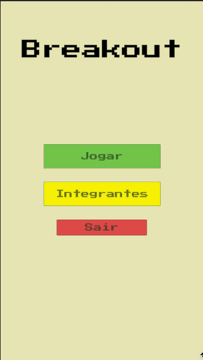

# Breakout - 7Group 👾

## Descrição do Projeto

Este projeto é uma recriação do clássico jogo Arkanoid/Breakout, desenvolvido como parte do Projeto Integrador VI-A da Universidade De Caxias do Sul pelo Grupo 7. No jogo, o jogador controla uma barra para rebater uma bola e destruir blocos. O objetivo é quebrar todos os blocos em cada nível sem deixar a bola cair.



## Tecnologias Utilizadas

- **Unity**: Utilizado como motor de jogo para criar e gerenciar todos os elementos e a lógica do jogo.
- **Rider**: IDE utilizada para desenvolvimento e depuração de scripts C#.
- **Visual Studio Community**: Alternativa utilizada para edição de código, depuração e gerenciamento de projetos Unity.
- **C#**: Linguagem de programação utilizada para criar a lógica do jogo, incluindo a movimentação da barra, a física da bola e a colisão com os blocos.

## Estrutura do Projeto

- **Assets**: Contém todos os recursos do jogo, como sprites, sons, prefabs e cenas.
- **Scripts**: Contém todos os scripts C# que definem a lógica do jogo.
- **Scenes**: Contém as cenas do jogo, como o menu principal e os níveis do jogo.

## Funcionalidades

- **Movimentação da Barra**: O jogador pode mover a barra para a esquerda e direita usando as teclas de seta ou o mouse.
- **Colisão com Blocos**: A bola destrói blocos ao colidir com eles, e a física da colisão é implementada para simular o comportamento esperado.
- **Vários Níveis**: Cada nível possui um layout diferente de blocos, e o jogo avança para o próximo nível quando todos os blocos são destruídos.
- **Sistema de Pontuação**: O jogador acumula pontos ao destruir blocos.
- **Menu Principal**:
    1. : Interface simples com as seguintes opções:
    2. **Iniciar Jogo**: Comece a jogar.
    3. **Integrantes**: Veja a lista de desenvolvedores do projeto.
    4. **Sair**: Encerre o jogo.

## Como Executar o Projeto

1. **Clonar o repositório**: Faça o clone do repositório para sua máquina local.
    
    ```bash
    git clone https://github.com/lssferreira/7Group-Breakout.git
    ```
    
2. **Abrir no Unity**: Abra o Unity e carregue o projeto a partir da pasta clonada.
3. **Executar o jogo**: Pressione o botão "Play" no Unity para iniciar o jogo.
